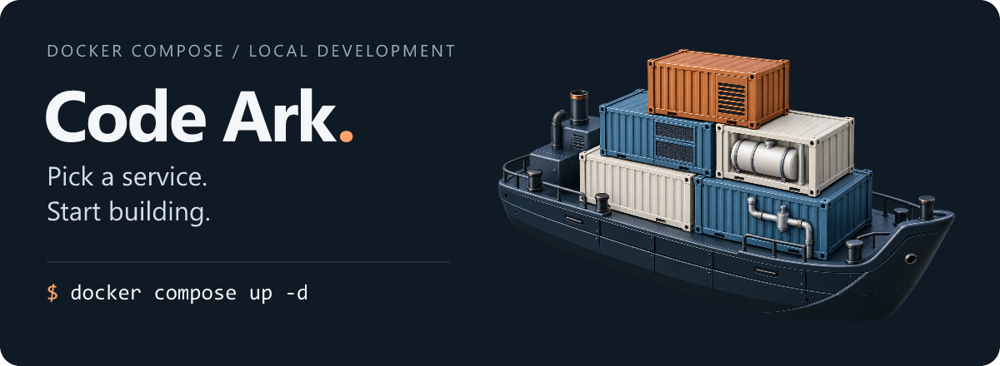

# Code Ark · Local infrastructure

<p align="center">
  
</p>

<p align="center">
  <a href="https://github.com/StephenQiu30/code-ark/stargazers"></a>
  <a href="https://github.com/StephenQiu30/code-ark/commits/main"></a>
  <a href="https://docs.docker.com/compose/"></a>
  <a href="./LICENSE"></a>
</p>

**Spend your setup time building your application.**

Code Ark brings together **16 Docker Compose configurations** for databases, caching, messaging, workflows, search, object storage, and monitoring. Choose a service directory and follow its setup instructions for local development, integration testing, or learning with Java, Go, Python, or Node.js.

[中文](./README.md) · [Quick start](#quick-start) · [Service catalog](#service-catalog) · [Daily use](#daily-use) · [Contribute](#contribute)

## Quick start

Start with Redis: it does not need an `.env` file. You need **Docker Engine / Docker Desktop, Docker Compose v2 or later, and Git**.

```bash
git clone https://github.com/StephenQiu30/code-ark.git
cd code-ark/redis-start-local
docker compose up -d
docker compose exec redis redis-cli ping
```

A `PONG` response means your host application can connect to `localhost:6379`. Run `docker compose stop` when finished; AOF data is kept in the service's `data/` directory.

> Some services need environment variables, initialization SQL, or an existing database. Read the selected service's README first. You do not need to run the whole collection.

## Find your starting point

- **Backend development** → [PostgreSQL](./pgsql-start-local/README.md), [MySQL](./mysql-start-lcoal/README.md), [Redis](./redis-start-local/README.md), [MinIO](./minio-start-local/README.md).
- **Messaging and background work** → [Kafka](./kafka-start-local/README.md), [RabbitMQ](./rabbitmq-start-lcoal/README.md), [Temporal](./temporal-start-local/README.md).
- **Service discovery and distributed apps** → [Nacos](./nacos-start-local/README.md), [Sentinel](./sentinel-start-local/README.md), [Seata](./seata-start-local/README.md).
- **Search, logs, and metrics** → [Elastic Stack](./elastic-start-local/README.md), [Prometheus / Grafana](./monitoring-start-local/README.md).
- **RSS and search APIs** → [RSSHub](./rsshub-start-local/README.md), [SearXNG](./searxng-start-local/README.md).

## Why keep these together?

**Choose by service.** Each directory contains its own Compose file and documentation. Services that reuse a database state their prerequisites explicitly.

**See where configuration and data live.** Environment-based services include `.env.example`; their guides cover ports, initialization, bind mounts, and named volumes.

**Use familiar Docker commands.** Most services start with `docker compose up -d`. Elastic Stack includes a build and memory-check script; specialized setup stays in the service guide.

## Service catalog

These are default host ports. Follow each service link for credentials, resource requirements, and setup details; adjust its configuration if a port is already in use.

### Data and storage

| Service | Default ports | Use |
| --- | --- | --- |
| [PostgreSQL 18](./pgsql-start-local/README.md) | `5432` | SQL, relational data, and initialization scripts |
| [MySQL 8.0](./mysql-start-lcoal/README.md) | `3306` | Relational data and application integration |
| [Redis](./redis-start-local/README.md) | `6379` | Caching, locks, and messaging experiments; AOF persistence |
| [MinIO](./minio-start-local/README.md) | `9000` / `9001` | S3-compatible API and web console |

### Messaging, workflows, and scheduling

| Service | Default ports | Use |
| --- | --- | --- |
| [Kafka + Kafka UI](./kafka-start-local/README.md) | `9092` / `19000` | Event streams, topics, and consumer groups |
| [RabbitMQ](./rabbitmq-start-lcoal/README.md) | `5672` / `15672` | AMQP messaging and web console |
| [RocketMQ](./rocketmq-start-local/README.md) | `15876` / `15909` / `15911` / `15912` / `18180` | NameServer, Broker, and Console |
| [Temporal + UI](./temporal-start-local/README.md) | `7233` / `18080` | Durable workflows; reuses this repo's PostgreSQL |
| [XXL-Job](./xxjob-start-local/README.md) | `18081` | Scheduler; requires MySQL and initialization SQL |

### Governance, search, and observability

| Service | Default ports | Use |
| --- | --- | --- |
| [Nacos](./nacos-start-local/README.md) | `8840` / `8848` / `9848–9850` | Discovery and configuration; create its external volume first |
| [Sentinel](./sentinel-start-local/README.md) | `8858` / `8719` | Traffic control, circuit breaking, and rule experiments |
| [Seata](./seata-start-local/README.md) | `7091` / `8091` | Distributed transactions; requires MySQL metadata tables |
| [Elastic Stack](./elastic-start-local/README.md) | `9200` / `5601` / `5044` | Search, IK analysis, logs, and Kibana |
| [Prometheus + Grafana](./monitoring-start-local/README.md) | `19090` / `13000` | Metrics, alerts, and dashboards |

Logstash also publishes `5000` (TCP / UDP) and `9600`; see its guide.

### Content and search APIs

| Service | Default port | Use |
| --- | --- | --- |
| [RSSHub](./rsshub-start-local/README.md) | `1200` | RSS routes using a Chromium bundled image |
| [SearXNG](./searxng-start-local/README.md) | `8888` | Metasearch and a JSON search API |

The [MediaCrawler version and patch guide](./mediacrawler-start-local/README.md) documents a host process, not a Compose service. The historical directory names `mysql-start-lcoal` and `rabbitmq-start-lcoal` are retained for compatibility.

## Daily use

Run these commands inside the selected service directory:

```bash
docker compose ps -a           # Include one-shot initialization tasks
docker compose logs -f        # Follow logs
docker compose stop           # Stop containers
docker compose up -d          # Start again
docker compose down           # Remove this project's containers and networks
```

For services that need `.env`, copy `.env.example` **on the first run** and set your own values. Keep an existing `.env`; PowerShell users can use `Copy-Item .env.example .env`. Never commit passwords, tokens, or API keys.

<details>
<summary><strong>Will my data persist? How do application containers connect?</strong></summary>

- `stop` and ordinary `down` preserve persistent directories and named volumes. `down -v` deletes this project's named volumes, not host bind mounts or external databases.
- Host applications use published ports. Inside a container, `localhost` means that container; follow its service guide for service names, container ports, or host access.
- Start `pgsql-start-local` before Temporal. Seata and XXL-Job need accessible MySQL databases and their metadata tables.
- Nacos needs an external named volume: run `docker volume create nacos-start-local-data` before its first startup.
- Start Elastic Stack with `./start.sh`. Its precheck requires at least 6 GB of Docker VM memory; use WSL or a compatible shell on Windows.

</details>

These configurations target local development and learning. Production deployment needs environment-specific authentication, TLS, backups, availability, and capacity planning. Some directories use `latest`; pin compatible versions when reproducibility matters.

## Contribute

Missing a service you use? [Request it](https://github.com/StephenQiu30/code-ark/issues/new) or add a template using the [contribution guide](./CONTRIBUTING.md). Startup fixes, documentation corrections, and practical feedback are welcome. Automation conventions live in [AGENTS.md](./AGENTS.md).

**If Code Ark saves you setup time, [give it a Star](https://github.com/StephenQiu30/code-ark).** Keep this toolbox handy for your next project.

## License

Repository configurations and documentation use the [MIT License](./LICENSE). Third-party software, images, and MediaCrawler remain subject to their own upstream licenses.
